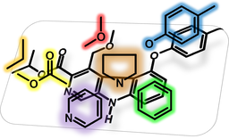

# Welcome to ToxPrint

[​ToxPrint](http://toxprint.org) is a publicly-available invariant reference set (or library) of structural features (substructures) targeted to cover chemical structures from the large toxicity databases and regulatory inventories (Yang, 2015). ToxPrint chemotypes were developed by Altamira LLC (now part of [​MN-AM](https://www.mn-am.com/)) for the CERES (Chemical Evaluation and Risk Estimation System) project of U.S. FDA Center for Food Safety and Applied Nutrition (CFSAN). Chemotypes including the ToxPrint chemotypes are implemented in the ChemoTyper, which was contracted from U.S. FDA to Molecular Networks GmbH (now part of [​MN-AM](https://www.mn-am.com/)).

## Chemotypes

This repository houses various chemotype files to support knowledge representation. Chemotypes are structural fragments (substructures) that can encode physicochemical, atomic, bond, and electronic properties in addition to the substructural connectivity. They can be associated with biological properties and modes of action in the toxicity pathways or with AOP (adverse outcome pathways) through the encoded properties in addition to a structural motif. Chemotypes use the CSRML (Chemical Substructures and Reactions Mark-up) language to represent both atom-bond connectivity as well as their properties such as pi-system or partial charges.

## ToxPrint Chemotypes

The ChemoTyper organizes the current version ToxPrint chemotypes into the following three functional areas.

*   Generic structural fragments
*   Structural rules and alerts
*   Category classifiers

### Generic Structural Fragments

Generic structural fragments are organized by atom, bond, chain, ring types as well as chemical groups including amino acids, carbohydrates, ligands, and nucleobases based on 729 essential chemotypes of the current ToxPrint set (version 2.0 r1520). These chemotypes can be used to generate chemical fingerprints, either in binary (0/1) or counts data. They can be used to calculate similarity measures or structural feature descriptors for building predictive models. (Yang 2015)

### Structural Rules and Alerts

Structural rules and alerts can be developed using ToxPrint chemotypes as building blocks. The chemotypes defined in the ToxPrint set can be further refined or coded with properties (atom, bond, molecular, electronic, or physicochemical) to constrain the matches and to enhance the signal-to-noise ratio of ToxPrint chemotypes when profiling the biological observations. To this end, the Chemotype Editor empowers users with the ability to fluently manipulate the CSRML query definitions graphically in a molecular editor. For further information, please contact MN-AM.

*   Ashby-Tennant Genotoxic Carcinogen Alerts
*   DNA binders
*   Protein binders
*   General liver alerts

### Category Classifiers

When characterizing different databases, TTC datasets, or inventories to differentiate their chemical spaces, an invariant reference set of structural features are required. In addition, when developing categories for regulatory inventories (cosmetics, drugs, agrochemicals, *etc.*) or representing particular toxicity or biological patterns within adverse outcome (AOP)/mode-of-action (MOA) pathways or ontology networks, designed chemotypes specifically to capture the underlying knowledge can be a powerful set of tools. To this end, the Chemotype Editor empowers users with the ability to fluently manipulate the CSRML query definitions graphically in a molecular editor. For further information, please contact MN-AM. Here are a few exicting category classifiers.

*   Threshold of Toxicological Concern (TTC) approach (part of ToxPrint library)
*   [​Organic Flame Retardant Chemotypes](http://www8.nationalacademies.org/onpinews/newsitem.aspx?RecordID=25412)
*   Antimicrobial Chemotypes (Yang 2020)
*   Per- and Polyfluoroalkyl Substances (PFAS) Chemotypes (based on ToxPrints) (Richard 2023)
*   Bisphenol Chemotypes 

The ToxPrint chemotype library is implemented in the XML-based CSRML language and can be applied using the publicly available [​ChemoTyper application](http://chemotyper.org).

## Updating ToxPrint Chemotype File in ChemoTyper Application

**Please note.** Updated ToxPrint CSRML files are not automatically replaced in your current [​ChemoTyper installation](http://chemotyper.org). To use new versions of ToxPrint chemotypes in your ChemoTyper installation, please follow the instructions below.

*   Close the ChemoTyper application
*   Download the ZIP archive that contains the latest ToxPrint CSRML file (named like "ToxPrint_V2.0_r\<number\>.xml")
*   Extract its content into a folder of your choice, *e.g.*, "Documents"
*   Start Windows File Explorer with administrative privileges (use "Run as Administrator" command)
*   Move the extracted ToxPrint_V2.0_r<number>.xml file you into the folder "share" of your ChemoTyper installation at "C:\Program files (x86)\Molecular Networks\ChemoTyper\share"

After that the content of the latest ToxPrint file can be loaded as usual from the Start page of the ChemoTyper application.

## References

*   (Richard 2023) [AM Richard, R Lougee, M Adams, H Hidle, C Yang, J Rathman, T Magdziarz, B Bienfait, AJ Williams, G Patlewicz. A New CSRML Structure-Based Fingerprint Method for Profiling and Categorizing Per- and Polyfluoroalkyl Substances (PFAS). *Chem Res Toxicol.* **2023**, *36(3)*, 508-534.](https://doi.org/10.1021/acs.chemrestox.2c00403).

*   (Yang 2020) [C Yang, M Cheeseman, J Rathman, A Mostrag, N Skouli, V Vitcheva, S Goldberg. A new paradigm in threshold of toxicological concern based on chemoinformatics analysis of a highly curated database enriched with antimicrobials. *Food and Chemical Toxicology* **2020**, *143*, 111561.](https://doi.org/10.1016/j.fct.2020.111561)

*   (Paul-Friedmann 2020) [K ​Paul-Friedman, M Gagne, L-H Loo, P Karamertzanis, T Netzeva, T Sobanski, J Franzosa, AM Richard, R Lougee, A Gissi, J-Y Joey Lee, M Angrish, J-L Dorne, S Foster, K Raffaele, T Bahadori, M Gwinn, J Lambert, M Whelan, M Rasenberg, T Barton-Maclaren, RS Thomas. Utility of In Vitro Bioactivity as a Lower Bound Estimate of In Vivo Adverse Effect Levels and in Risk-Based Prioritization. *Toxicol. Sci.* **2020**, *173*, 202-225.](https://doi.org/10.1093/toxsci/kfz201)

*   (Nyfeller 2020) [​J Nyffeler, C Willis, R Lougee, AM Richard, K Paul-Friedman, JA Harrill. (2020). Bioactivity screening of environmental chemicals using imaging-based high-throughput phenotypic profiling. Toxicology and Applied Pharmacology **2020**, *389*, 114876.](https://www.sciencedirect.com/science/article/pii/S0041008X19304843)

*   (Kosnik 2016) [MB ​Kosnik, JD Strickland, SW Marvel, D Wallis, K Wallace, AM Richard, DM Reif, TJ Shafer. Concentration-Response Evaluation of ToxCast Compounds for Multivariate Activity Patterns of Neural Network Function Archives of Toxicology. *Function. Arch. Toxicol.* **2019**, *94*, 469-484.](https://doi.org/10.1007/s00204-019-02636-x)

*   (Wang 2019) [​J Wang, DR Hallinger, AS Murr, AR Buckalew, RR Lougee, AM Richard, SC Laws, TE Stoker. High-throughput screening and chemotype-enrichment analysis of ToxCast phase II chemicals evaluated for human sodium-iodide symporter (NIS) inhibition. *Environment International* **2019**, *126*, 377-386.](https://www.sciencedirect.com/science/article/pii/S0160412018321196)

*   (Nelms 2019) [MD ​Nelms, R Lougee, DW Roberts, AM Richard, G Patlewicz. Comparing and contrasting the coverage of publicly available structural alerts for protein binding. *Computational Toxicology* **2019**, *12*, 100100.](https://www.sciencedirect.com/science/article/pii/S2468111319300283)

*   (Yang 2015) [​C Yang, A Tarkhov, J Marusczyk, B Bienfait, J Gasteiger, T Kleinoeder, T Magdziarz, O Sacher, CH Schwab, J Schwoebel, L Terfloth, K Arvidson, A Richard, A Worth, J Rathman. New Publicly Available Chemical Query Language, CSRML, To Support Chemotype Representations for Application to Data Mining and Modeling. *J. Chem. Inf. Model.* **2015**, *55(3)*, 510-528.](http://pubs.acs.org/doi/abs/10.1021/ci500667v)

## Contact

For technical support please contact [​support@mn-am.com](mailto:support@mn-am.com).

## Acknowledgement

The ChemoTyper application was developed by Molecular Networks GmbH, Erlangen, Germany under a contract from the U.S. FDA Center for Food Safety and Applied Nutrition (CFSAN), Office of Food Additive Safety.

The XML-based substructure (or chemotype) definition language CSRML was co-developed in collaboration with Altamira LLC, Columbus, OH, USA.

Visit the [​website](https://www.mn-am.com) of Molecular Networks GmbH and Altamira LLC.
